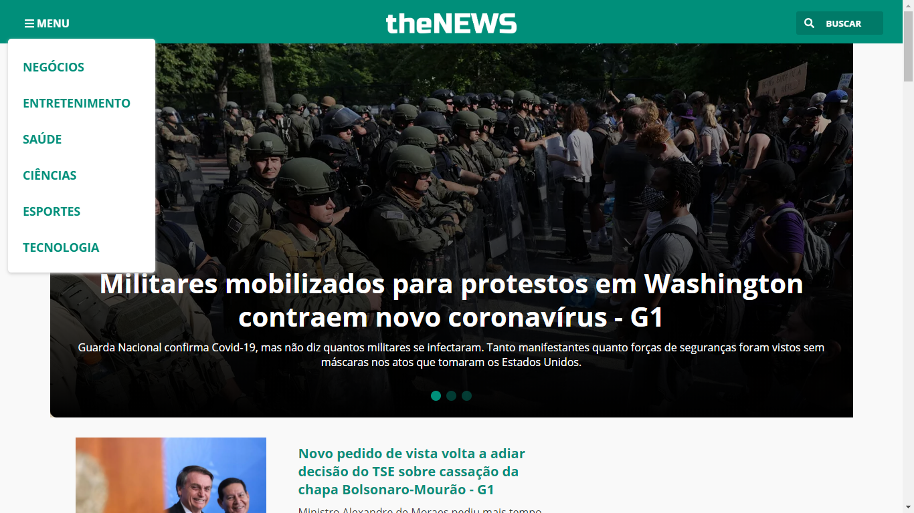

<h1 align="center">
    
</h1>

  <a href="#-technologies">Technologies</a>&nbsp;&nbsp;&nbsp;|&nbsp;&nbsp;&nbsp;
  <a href="#-project">Project</a>

 

  

## 🚀 Technologies

Developed with the following technologies:

- Javascript
- HTML
- CSS
- Babel
- Webpack / Webpack Dev Server

## 💻 Project

Is a search engine for news from different categories and websites using the Google News API. Created with the intention of practicing and learning new technologies. Design inspired by G1 portal.
